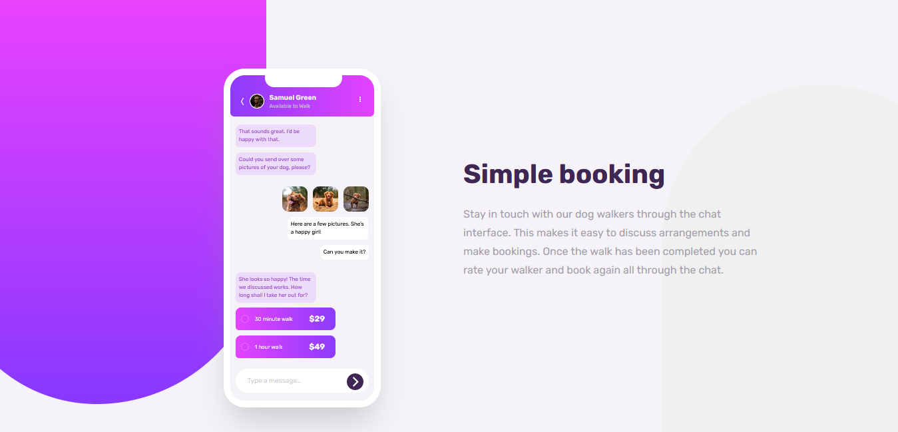

# Frontend Mentor - Chat app CSS illustration solution

This is a solution to the [Chat app CSS illustration challenge on Frontend Mentor](https://www.frontendmentor.io/challenges/chat-app-css-illustration-O5auMkFqY). Frontend Mentor challenges help you improve your coding skills by building realistic projects. 

## Table of contents

- [Overview](#overview)
  - [The challenge](#the-challenge)
  - [Screenshot](#screenshot)
  - [Links](#links)
- [My process](#my-process)
  - [Built with](#built-with)
  - [Continued development](#continued-development)
- [Author](#author)

## Overview
I took this challenge to improve my html and css skills, see how senoirs developers orginize their code and use best practices. I'm still learning and I'm open to any feedback.

### The challenge

Users should be able to:

- View the optimal layout for the component depending on their device's screen size
- **Bonus**: See the chat interface animate on the initial load

### Screenshot

### Links

- Solution URL: [Add solution URL here](https://github.com/youssefKetata/chat-app-css-illustration)
- Live Site URL: [Add live site URL here](https://chat-app-css-illustration-ebon.vercel.app/)

## My process
I started by viewing the design that was provided to me. I tried to break it down into smaller components and imagine wich css goups should i make and how to orginize my html.
I started by making the drops, then the main section. I used css flex-box to orginize the main section. I made the chat section and the user section. I used flexbox to orginize the user section. I used css variables to make the code more readable and easy to change. I used media queries to make the design responsive. I used css animations to animate the chat section on the initial load.

### Built with

- Semantic HTML5 markup
- CSS custom properties
- Flexbox
- CSS Grid

### Continued development

I want to learn more about css animations and how to use them in my projects.

## Author

- Frontend Mentor - [@Youssef Ketata](https://www.frontendmentor.io/profile/youssefKetata)

